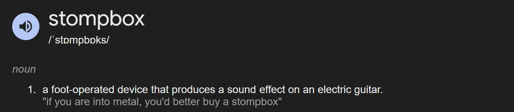
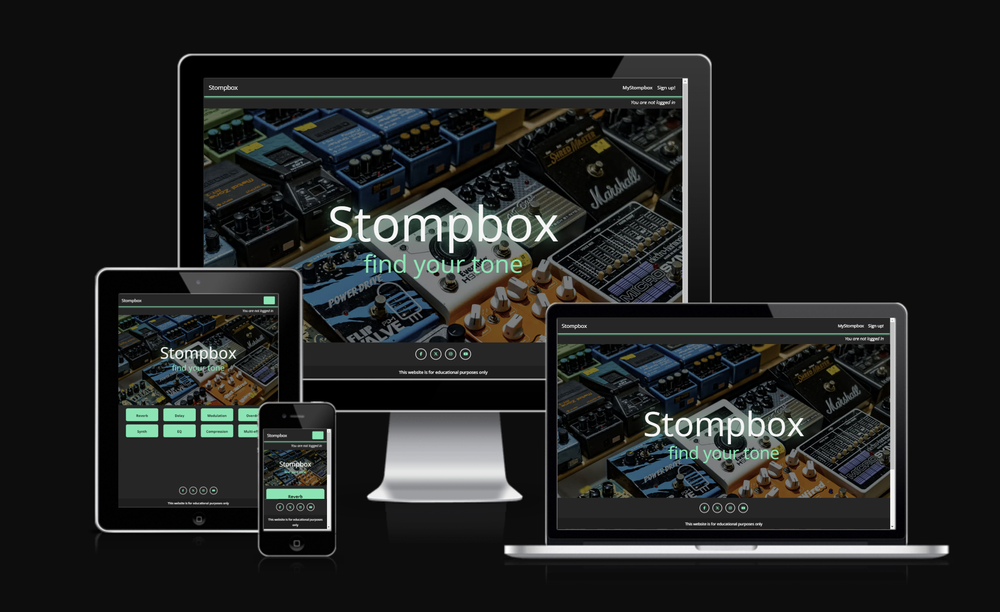

# Stompbox

View the live website here!

https://stompbox-340be760f293.herokuapp.com/

## 1. Overview
Stompbox is an effects pedal listing site, where sellers can create an account and list their pedals for sale.  Potential buyers can browse pedals by category and contact sellers for more information or to complete a private sale, much like Gumtree.  The site provides CRUD functionality to sellers for their account and listings.

This website was built with the Django framework, PostgreSQL and Python for the back-end and HTML, CSS, Javascript and Bootstrap for the front-end.  This is my fourth project as part of Code Institute's Full-Stack Software Development course.

## 2. User Experience (UX)

### 2.1 Objective

To provide a marketplace for sellers and buyers of used effects pedals.  The aim is to provide an intuitive website for sellers to create an account and list a pedal and also be an enjoyable experience for buyers to browse and buy pedals.

### 2.2 Target Market

Effects pedals have historically been used by guitarists.  However, with the explosion of home music production in recent years, effects pedals are now widely used by musicians and producers of all backgrounds.  Producers, especially, are now seeking truer tones than those offered by digital plugins.  As a result the number of independent pedal manufacturers has risen, often creating unique pedals that bring new, previously unheard effects to the market.

Therefore, the target market for Stompbox will mainly be musicians and producers of all ages, with disposable income, who have an interest in buying or selling used effects pedals.

### 2.3 User Stories

The following user stories and their acceptance criteria helped define the requirements of Stompbox.  These can all be found in GitHub issues [here](https://github.com/ShieldsJohn/Stompbox/issues) which I will explain in further detail later in this README.

In summary they form part of the following requirements:

- User authentication and CRUD functionality for user account
- CRUD functionality for user listings
- Logically structured site and contents
- Intuitive and responsive website

### As a seller I need a website that is intuitive to use, so I can easily sell my pedals.

Acceptance Criteria:

As a seller, I can intuitively navigate the website.
As a seller, information and process steps are clear and easy to follow.
As a seller, I can contact Stompbox for assistance if required.

### As a user I can use a variety of devices to use the website.

Acceptance Criteria:

As a user I have a seamless, consistent experience on all devices from mobile phones to desktop computers.
As a user, I can see the content and navigation be optimised for the device I am using.

### As a registered seller I can log-in and log-out so that I can securely access and leave my account.

Acceptance Criteria:

As a seller, I have a log-in button easily accessible when not logged in which takes me to a log-in form.
As a seller, I will submit my email address and password to securely log-in to my account via the log-in form.
As a logged-in seller, I can see my logged in status from each page on the site.
As a logged-in seller, I have access to a log-out button from each page on the site.
As a logged-in seller, when I log out, I am presented with a confirmation message and a log-in button returns to the webpages.

### As a seller I can create an account so that I can create and manage listings.

Acceptance Criteria:

As an unregistered seller, I am presented with a sign-up button on the home page, which takes me to a registration form.
As an unregistered seller, I expect to submit my name, email address and password on the registration form to be become an authorised seller.

### As a seller I can view and edit my account so that I can keep my information up-to-date.

Acceptance Criteria:

As a seller, I can easily access my account information upon log-in.
As a seller, I can easily edit my account information and save the changes.

### As a seller I can delete my account so that all my information and listings are removed from the site.

Acceptance Criteria:

As a seller, on My Account page, I have an option to 'Delete Account'.
As a seller, when I select 'Delete Account', I am presented with a message confirming if I wish to proceed with account deletion.
As a seller, upon confirming account deletion, I receive a message confirming deletion.
As a deregistered seller, if I attempt to log-in, I am presented with a message stating 'User does not exist, do you want to sign-up to Stompbox'.

### As a user (buyer or seller), I can click on seller usernames so I can see their profile.

Acceptance Criteria:

As a user, when I click on a seller's username or profile picture, I am taken to their profile page and can view their user info.

### As a registered seller, I can reset my password to keep my account secure.

Acceptance Criteria:

As a registered seller, when at the log-in screen I have an option to select 'Forgot Password' to reset my password. This will present me with a form to enter my email address.
As a registered seller, I will receive an email with a link to a password reset page.
As a registered seller, upon clicking the password reset link, I will be taken to the password reset page and upon submitting my new password, I will receive confirmation that the reset has been successful.

### As a seller I can create a listing to sell my pedal.

Acceptance Criteria:

As a seller, I can easily navigate to a page where I can create a listing.
Upon navigating to a 'create listing' page, I am presented with a form where I can submit listing information.
This form will also allow me to submit photos of my pedal, in order for potential buyers to see exactly what I'm selling.
Upon submitting the form and photos, I am presented with confirmation of a successful listing submission.

### As a seller I can view the listing I have just created.

Acceptance Criteria:

Upon confirmation of successful listing submission I expect to either receive a confirmation message of be redirected to my listing.
As a seller I would like to see a list of my listings on one page.
From this page, I would like to select a listing to view the details and photos I have submitted.
I would like to easily navigate back to the list of listings.

### As a seller I can update my listing to provide the most accurate information to potential buyers.

Acceptance Criteria:

From MyListings, I can easily select a listing to update via a button.
Upon doing so, I am presented with a form to update the required information and /or photos.
Once updated, I am presented with confirmation of the successful update and returned to MyListings.

### As a seller I can delete my listing so that it no longer appears anywhere on the site.

Acceptance Criteria:

From MyListings, I can easily delete a listing via a button.
Once selected, I am presented with the option to confirm or cancel my deletion.
Upon cancellation, I am returned to MyListings.
Upon deletion, I receive a confirmation message and I'm returned to MyListings, where I can see the listing no longer exists.

### As a user I can browse for pedals by category so that I can focus my search and view relevant pedals.

Acceptance Criteria:

As a user, I am presented with selectable category buttons on the home screen so I can immediately start my search.
Upon selecting the category, I can view relevant listed pedals.
From the chosen category screen, I can easily navigate back to the home screen to view other categories.

### As a user I can select a pedal listing to view all the relevant information and contact the seller to complete a purchase.

Acceptance Criteria:

As a user, from the category page, I can click on a preview image of the listing and be taken to a page which contains all listing details.
To help me decide on a purchase, I want to be presented with the following information: pedal name, pedal manufacturer, who listed the item and when, the price, the condition of the pedal, a description and some images.
If I still have questions on the item or if I would like to contact the seller to arrange a purchase, I would like a link on this page to do so.
When clicking the contact link, I expect to be provided a form where I can type a message and provide my email address for the seller to respond to.
When I submit my message, I would like confirmation that it has been submitted successfully and I should be returned to the home page to view categories again, should I wish to continue browsing.

