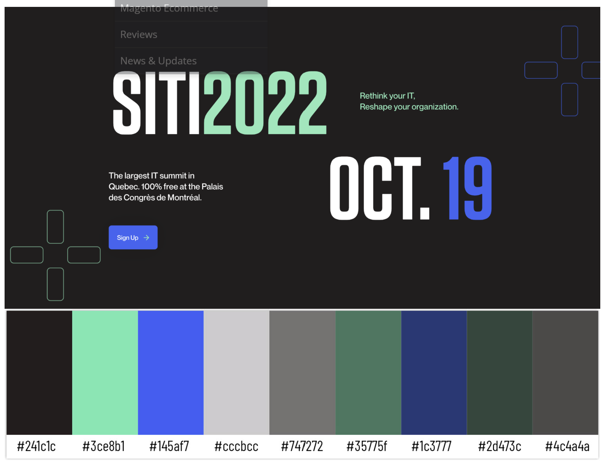
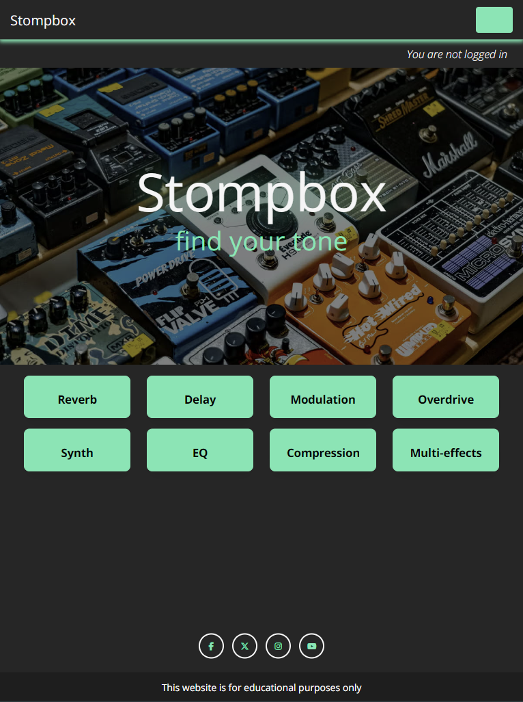
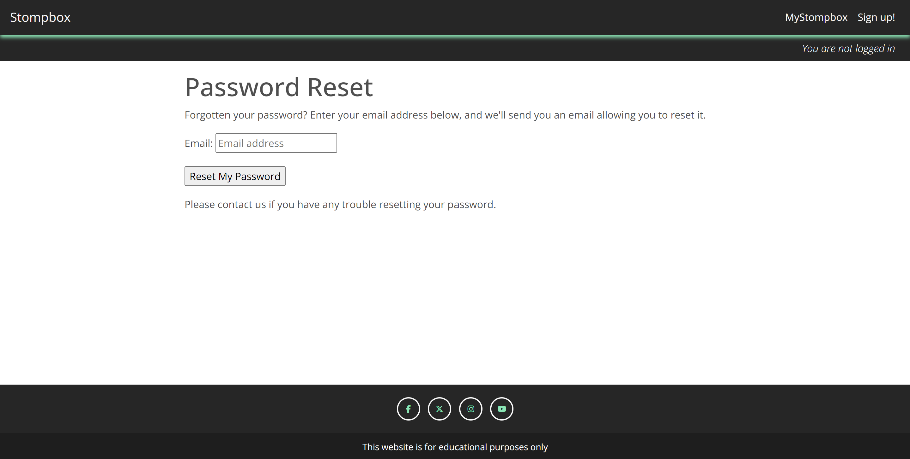
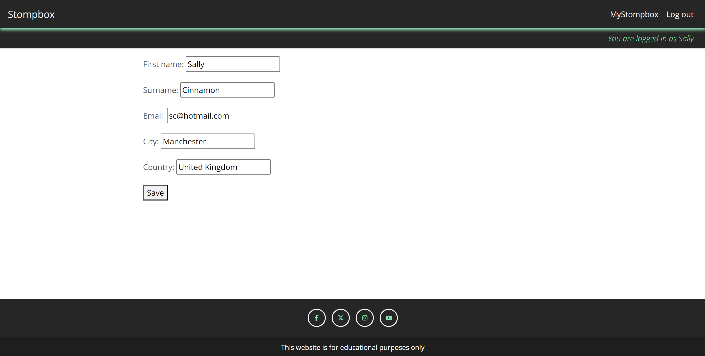
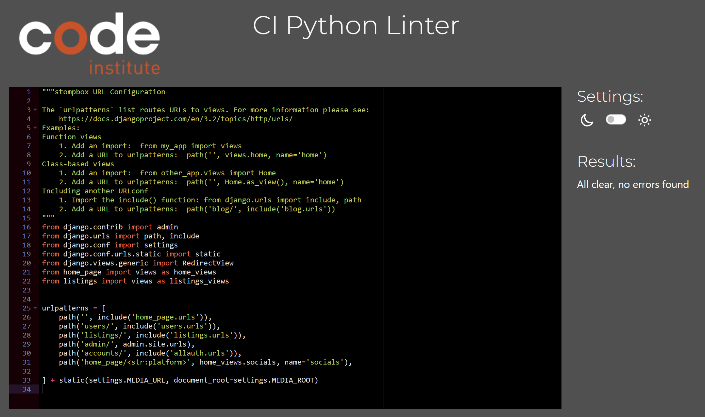

# Stompbox

View the live website here!

https://stompbox-340be760f293.herokuapp.com/

## 1. Overview
Stompbox is an effects pedal listing site, where sellers can create an account and list their pedals for sale.  Potential buyers can browse pedals by category and contact sellers for more information or to complete a private sale, much like Gumtree.  The site provides CRUD functionality to sellers for their account and listings.

This website was built with the Django framework, PostgreSQL and Python for the back-end and HTML, CSS, Javascript and Bootstrap for the front-end.  This is my fourth project as part of Code Institute's Full-Stack Software Development course.

## 2. User Experience (UX)

### 2.1 Objective

To provide a marketplace for sellers and buyers of used effects pedals.  The aim is to provide an intuitive website for sellers to create an account and list a pedal and also be an enjoyable experience for buyers to browse and buy pedals.

### 2.2 Target Market

Effects pedals have historically been used by guitarists.  However, with the explosion of home music production in recent years, effects pedals are now widely used by musicians and producers of all backgrounds.  Producers, especially, are now seeking truer tones than those offered by digital plugins.  As a result the number of independent pedal manufacturers has risen, often creating unique pedals that bring new, previously unheard effects to the market.

Therefore, the target market for Stompbox will mainly be musicians and producers of all ages, with disposable income, who have an interest in buying or selling used effects pedals.

### 2.3 User Stories

The following user stories and their acceptance criteria helped define the requirements of Stompbox.  These can all be found in GitHub issues [here](https://github.com/ShieldsJohn/Stompbox/issues) which I will explain in further detail later in this README.

In summary they form part of the following requirements:

- User authentication and CRUD functionality for user account
- CRUD functionality for user listings
- Logically structured site and contents
- Intuitive and responsive website

### As a seller I need a website that is intuitive to use, so I can easily sell my pedals.

Acceptance Criteria:

As a seller, I can intuitively navigate the website.
As a seller, information and process steps are clear and easy to follow.
As a seller, I can contact Stompbox for assistance if required.

### As a user I can use a variety of devices to use the website.

Acceptance Criteria:

As a user I have a seamless, consistent experience on all devices from mobile phones to desktop computers.
As a user, I can see the content and navigation be optimised for the device I am using.

### As a registered seller I can log-in and log-out so that I can securely access and leave my account.

Acceptance Criteria:

As a seller, I have a log-in button easily accessible when not logged in which takes me to a log-in form.
As a seller, I will submit my email address and password to securely log-in to my account via the log-in form.
As a logged-in seller, I can see my logged in status from each page on the site.
As a logged-in seller, I have access to a log-out button from each page on the site.
As a logged-in seller, when I log out, I am presented with a confirmation message and a log-in button returns to the webpages.

### As a seller I can create an account so that I can create and manage listings.

Acceptance Criteria:

As an unregistered seller, I am presented with a sign-up button on the home page, which takes me to a registration form.
As an unregistered seller, I expect to submit my name, email address and password on the registration form to be become an authorised seller.

### As a seller I can view and edit my account so that I can keep my information up-to-date.

Acceptance Criteria:

As a seller, I can easily access my account information upon log-in.
As a seller, I can easily edit my account information and save the changes.

### As a seller I can delete my account so that all my information and listings are removed from the site.

Acceptance Criteria:

As a seller, on My Account page, I have an option to 'Delete Account'.
As a seller, when I select 'Delete Account', I am presented with a message confirming if I wish to proceed with account deletion.
As a seller, upon confirming account deletion, I receive a message confirming deletion.
As a deregistered seller, if I attempt to log-in, I am presented with a message stating 'User does not exist, do you want to sign-up to Stompbox'.

### As a user (buyer or seller), I can click on seller usernames so I can see their profile.

Acceptance Criteria:

As a user, when I click on a seller's username or profile picture, I am taken to their profile page and can view their user info.

### As a registered seller, I can reset my password to keep my account secure.

Acceptance Criteria:

As a registered seller, when at the log-in screen I have an option to select 'Forgot Password' to reset my password. This will present me with a form to enter my email address.
As a registered seller, I will receive an email with a link to a password reset page.
As a registered seller, upon clicking the password reset link, I will be taken to the password reset page and upon submitting my new password, I will receive confirmation that the reset has been successful.

### As a seller I can create a listing to sell my pedal.

Acceptance Criteria:

As a seller, I can easily navigate to a page where I can create a listing.
Upon navigating to a 'create listing' page, I am presented with a form where I can submit listing information.
This form will also allow me to submit photos of my pedal, in order for potential buyers to see exactly what I'm selling.
Upon submitting the form and photos, I am presented with confirmation of a successful listing submission.

### As a seller I can view the listing I have just created.

Acceptance Criteria:

Upon confirmation of successful listing submission I expect to either receive a confirmation message of be redirected to my listing.
As a seller I would like to see a list of my listings on one page.
From this page, I would like to select a listing to view the details and photos I have submitted.
I would like to easily navigate back to the list of listings.

### As a seller I can update my listing to provide the most accurate information to potential buyers.

Acceptance Criteria:

From MyListings, I can easily select a listing to update via a button.
Upon doing so, I am presented with a form to update the required information and /or photos.
Once updated, I am presented with confirmation of the successful update and returned to MyListings.

### As a seller I can delete my listing so that it no longer appears anywhere on the site.

Acceptance Criteria:

From MyListings, I can easily delete a listing via a button.
Once selected, I am presented with the option to confirm or cancel my deletion.
Upon cancellation, I am returned to MyListings.
Upon deletion, I receive a confirmation message and I'm returned to MyListings, where I can see the listing no longer exists.

### As a user I can browse for pedals by category so that I can focus my search and view relevant pedals.

Acceptance Criteria:

As a user, I am presented with selectable category buttons on the home screen so I can immediately start my search.
Upon selecting the category, I can view relevant listed pedals.
From the chosen category screen, I can easily navigate back to the home screen to view other categories.

### As a user I can select a pedal listing to view all the relevant information and contact the seller to complete a purchase.

Acceptance Criteria:

As a user, from the category page, I can click on a preview image of the listing and be taken to a page which contains all listing details.
To help me decide on a purchase, I want to be presented with the following information: pedal name, pedal manufacturer, who listed the item and when, the price, the condition of the pedal, a description and some images.
If I still have questions on the item or if I would like to contact the seller to arrange a purchase, I would like a link on this page to do so.
When clicking the contact link, I expect to be provided a form where I can type a message and provide my email address for the seller to respond to.
When I submit my message, I would like confirmation that it has been submitted successfully and I should be returned to the home page to view categories again, should I wish to continue browsing.

## 3. Design

### 3.1 Wireframes

After identifying the requirements of the website, my first design considerations were to plan how this would meet those requirements from a mobile-first perspective.  Here are some examples of the initial planning.

### Home page

As is customary on a home page, I wanted to have a hero image which depicts the purpose of the website - in this case, an image of effects pedals.  This is overlaid with a title and tagline.

The requirements of the user stories dictated that it must be intuitive and logical to browse.  Therefore I planned to have the user browser by category, which when selected takes the user to the category page in the next imamge.  Although not designed here, it was also intended to have login/sign up and footer on the home page.

### Category page

The category page should display images of the pedals for sale in the chosen category.  Minimal information on the pedal should be displayed to not clutter the page and to lead the user to the listing page for full listing information.

### Listing page

The listing page should show all the information provided by the seller on the pedal, along with images.  The plan was to utilise a carousel to scroll through the images on mobile devices, but I was unable to put this in place.

There should also be functionality to contact the seller to ask questions or progress to a sale.

### 3.2 Colour

I wanted to keep colour choices simple with a predominantly tri-colour theme.  I wanted something modern and strikng.  When looking for inspiration, I came across the below.

So I decided to use a vibrant light green, set against the monochrome black and white.  However, I preferred Bootstrap's 'dark', which is a very dark grey, in place of the black.  These colour choices and others used are below.

### Green

### White

### Whitesmoke

Only used on navbar links and home page title, as a variation to the white pages.

### Bootstrap - Dark

### Bootstrap - Red

Only used on delete confirmation buttons for listings and user account.

### 3.3 Fonts

I used Open Sans from Google Fonts, as I feel this reflected the modern style I was aiming for.

### 3.4 Database Schema

I have used the Allauth user model to take advantage of the user functionality it provides, in terms of registering username, email, password etc.  This has a one-to-one relationship with the custom profile model.

I planned and created five additional models as shown above:

### Profile model

I created the profile model as an extension of the user model, to store and retrieve more user information such as full name, city and country.  This model has a one-to-many relationship as it is ForeignKey to the listing model and also has a one-to-one relationship with the Allauth user model. 

### Listing model

The listing model stores all the listing information and has a many-to-one relationship, receiving data from all other custom models.

### Pedal model

The pedal model stores pedal specific data, such as manufacturer and category which are foreign keys from those respective models.  The pedal name is also a ForeignKey to the listings model.

### Manufacturer model

This stores the manufacturer names and is a ForeignKey in the pedal model.

### Category model

This has a one-to-many relationship as many pedals and listings will use category data from this model.

## 4. Agile Methodology

The planning and execution of this project was carried out by following aigle principles.  The main milestones or epics of the project were identified, the user stories relating to achieving these milestones were assigned and tasks were listed.  This was all administered through Github Issues, as shown below.

### All Epics (Milestones)

### An Example Epic

### An Example User Story

### 4.1 Github Projects

The workflow for this was managed using Github projects, the user stories below moved through the Kanban, depending on the stage of progress, from To Do, In Progress to Done, or Unfinished or Bugs.

### 4.2 MoSCoW Prioritisation

This is a method of identifying and prioritising the most crucial tasks in a project first.  MoSCoW stands for Must Have, Should Have, Could Have and Won't Have.  From the image below you can see examples of this prioritisation in action.

## 5. Features

### 5.1 Navbar

This navbar is displayed at the top of each page and is fully responsive.  It was created with Bootstrap.  The 'Stompbox' title serves as a home page link.  There are also links for MyStompbox which will take logged in users to their MyStompbox account, or it will ask non-logged-in users to either log-in or sign-up.  There is also a 'Sign Up' link which is a more direct way for unregistered users to sign up.  All links have a green hover effect to aid user feedback.

There is also a logged-in indicator that will read as 'You are not logged in' by default.  Only when a user is logged in, will it turn green and read as 'You are logeed in as 'user''.

### 5.2 Footer

The footer is displayed at the bottom of each page and is fully responsive.  It was created with Bootstrap.  The footer serves as a quick link to Stompbox's social media sites, which will open on new browser tabs.  The icons are hyperlinks to the respective social media sites and will turn white on hover, to aid user feedback.

### 5.3 Home page

The first thing you'll see on the home page is a hero image showing effects pedals.  This is to make it immediately clear what the main focus of the website is.  The title 'Stompbox' is concise, memorable and a familiar term to those who use effects pedals.  This along with the tagline 'find your tone' reinforces the purpose of the website.

The category buttons below the hero image allow the user to immediately start browsing for pedals by category.  These also animate when hovered over to provide user feedback.

### 5.4 Category page

When a user selects a category to browse, they are taken to this page which displays all pedals for sale in that category.  There is also a button to return to the home page to view the other categories.

### 5.5 Pedal detail page

When a user clicks on an image of a pedal from the category page, they are taken to a pedal detail page, where they can see a listing information and two large images of the pedal for closer inspection.  There is also a button to return the user to the category page and a 'Contact Seller' link, so the user can contact the seller for more information.

### 5.6 Contact Seller

When a user selects 'Contact Seller' from the pedal detail page, they are taken to the contact seller page a form is displayed for the the user to submit a subject, message and their own email address.  At this point, the email functionality is not in place to send this to the seller.  The user will be returned to the home page a message success message is displayed for confirmation.

### 5.7 Sign up

When the user selects 'Sign up!' from the home page, they are presented with a form where they must submit a unique username, unique email address, password and password confirmation.  If either the username or email address are not unique, the user will receive a message, asking them to do so.  Likewise, if the passwords do not meet the requested criteria, warning messages will remind the user to submit a valid password.

Once signed up, the user is returned to the home page and their logged-in status shows as logged in, a sign up success message is also displayed.

### 5.8 Log in

When a user selects 'MyStompbox' from the home page, they are taken to the Log in page, where they will submit their username and password.  If the password is invalid, a message tells them it's incorrect and to try again.  If the login in successful, the user is taken to the 'MyStompbox' page.

### 5.9 Forgot Password

When a user selects 'Forgot Password' from the log in page, they are taken to the password reset page, where they can submit their email address to receive a password reset link by email.

Note, as before, there is no email functionality in this project yet.  When the user submits, they are taken to a password confirmation page with further instructions.  From there, they have the option to return to the home page.

### 5.10 Log out

When a user selects 'Log out' from the navbar, they are taken to the log out page where they can either select 'Log out' or 'Return to MyStompbox'.  If they chose 'Log out', they are redirected to the home page and a log out success message is displayed.

### 5.11 MyStompbox

When a user has logged in they are taken to the MyStompbox page.  This is where they can update thier profile information in MyAccount and in MyListings they can create, view, update and delete listings.  They can also delete their MyStompbox (user account and all associated listings) here too.

### 5.12 MyAccount

When a user selects 'MyAccount' from the MyStompbox page, they are taken to the MyAccount page where they can view the current information held.  If the user selects 'Update MyAccount', they are taken to the page below, where they can submit new profile information.  Upon submission, the user is taken to a success page, where they then have the option to return to 'MyStompbox'.

### 5.13 MyListings

When a user selects 'MyListings' from the MyStompbox page, they are taken to the MyListings page, where if they have previously created listings, these will be listed, along with options to view, update or delete.  If they have not previously created any listings, a message is displayed inviting them to do so.  There is also an option to return to MyStompbox.

### 5.14 Create Listing

When a user selects 'Create Listing' from MyListings page, they are taken to a create listing form, where they can submit all the required information and upload two images.  All fields including images are required and the user will be warned if anything is incomplete.  When the user submits by clicking 'Create Listing', they are returned to MyListings, where they can see their new listing.

### 5.15 View Listing

When a user selects 'View Listing' from MyListings page, they are taken to the view listing page where they can see the details and images they have sumitted.  There is also a button to 'Return to MyListings'.

### 5.16 Update Listing

When a user selects 'Update Listing' from MyListings page, they are taken to the update listing page where the form the user completed when creating the listing is displayed with all current listing infomrmation populated.  The user can then change the relevant information and submit.  Again, they will be returned to MyListings.

### 5.17 Delete Listing

When a user selects 'Delete Listing' from MyListings, they are taken to the delete listing page, where they are presented with the choices of 'Yep' or 'Not yet'.  If the user proceeds with the deletion, they are returned to MyListings, where they can see the listing no longer exists and a deletion success message is displayed.  If the user cancels the deletion, the user again is returned to MyListings, but a deletion cancellation message is displayed.

### 5.18 Delete MyStompbox

When a user selects 'Delete MyStompbox' from MyStompbox, they are taken to the delete MyStompbox confirmation page, where they have the choices of 'Yes, unfortunately so...' or 'No!  What am I doing?!'.  If no is selected, the user is returned to MyStompbox and a deletion cancellation message is displayed.  If the user selects yes, the user is returned to the home page, where a deletion success message is displayed and the logged-in indicator shows they are no longer logged in.  All user information and related listings are deleted and no longer visible on the website.

### New Features

New features to include in the future are:

- Add email functionality to allow users to reset password and contact seller
- Allow users to add their own pedals and not just select from a menu
- Add search functionality i.e. by manufacturer or pedal name
- Add more customisation of profiles and allow non-registered to view seller profles
- Allow buyers to create an account and profile
- Allow buyers to add pedals to favourites
- Add notifications to buyers if a favourited pedal is no longer available

## 6. Testing

### 6.1 Code Validation

### HTML

All HTML testing has passed validation with https://validator.w3.org/ as demonstrated below.  This was done by right-clicking on a given webpage and selecting 'View Page Source', then copying the rendered code and pasting in the 'Validate by direct input' field on W3C, click check and then resolve any errors found by correcting in the html files.

### Home

### Sign up

### Log in

### Log out

### Password Reset

### Password Reset Done

### Category

### Pedal detail

### MyListings

### Create Listing

### Listing Detail

### Update Listing

### Delete Listing

### CSS

The style.css file passed validation at https://jigsaw.w3.org/css-validator/

This was done by copying the code from the style.css file and pasting it into the 'By direct input' field, seleting 'Check' then addressing any issues by correcting the style.css file.

### JavaScript

All JS files have passed validation at https://jshint.com/

This was done by copying the code from each of the JS files and pasting in the input field at jshint.com.  Any errors are detailed on the side and are addressed by reviewing and correcting the code in the JS files.

### animation.js

### card_titles.js

### listing_form_format.js

### Python

All Python files passed validation at https://pep8ci.herokuapp.com/ except settings.py, as the AUTH_PASSWORD_VALIDATORS exceed the character length and I could not reduce the size of them.

This was done by copying the code from the python files and pasting into the pep8ci field.  I then address any errors in the python files.

### Home page apps.py

### Home page urls.py

###  Home page views.py

###  Listings admin.py

### Listings apps.py

### Listings forms.py

### Listings models.py

### Listings urls.py

### Listings views.py

### manage.py

### Stompbox asgi.py

### Stompbox settings.py

### Stompbox urls.py

### Stompbox wsgi.py

### Users admin.py

### Users forms.py

### Users models.py

### Users urls.py

### Users views.py

## 6.2 Test Cases

Here I manually tested all features and documented the outcomes.

### Test Case 1 - User can browse and contact seller

### Test Case 2 - User sign up

### Test Case 3 - User log in and out

### Test Case 4 - User update MyAccount

### Test Case 5 - User create listing

### Test Case 6 - User view listing

### Test Case 7 - User update listing

### Test Case 8 - User delete listing

### Test Case 9 - User delete MyStompbox

### Test Case 10 - User navbar and footer navigation

## 6.3 Lighthouse

I have tested for accessibility using Lighthouse within Chrome Dev Tools.  Here is a sample of those results.

### Home page

### Mobile

### Desktop

### Category

### Mobile

### Desktop

### Listing detail

### Mobile

### Desktop

## 6.4 Responsiveness

I have tested responsiveness through the development process to ensure page layouts and content looks appropriate on each device size.  I tested this with Chrome Dev Tools and on my personal iPhone 14 and Lenovo Thinkpad.  Here are some samples.

### Home page

### Mobile

### Tablet

### Laptop

### Category

### Mobile

### Tablet

### Laptop

### Pedal detail

### Mobile

### Tablet

### Laptop

## 7. Bugs

During development I encountered the following bugs:

### Open

[Burger menu icon disappearing](https://github.com/ShieldsJohn/Stompbox/issues/24)

[Card title lengths exceeding card widths](https://github.com/ShieldsJohn/Stompbox/issues/40)

### Closed

[Social media links connecting to relevant site](https://github.com/ShieldsJohn/Stompbox/issues/26)

[Exceeding character limit in Listing model](https://github.com/ShieldsJohn/Stompbox/issues/27)

[URL tags not working after moving AllAuth templates](https://github.com/ShieldsJohn/Stompbox/issues/28)

[User profiles not deleting](https://github.com/ShieldsJohn/Stompbox/issues/29)

[Unable to migrate changes to Listings model](https://github.com/ShieldsJohn/Stompbox/issues/30)

[Listings not linked to user](https://github.com/ShieldsJohn/Stompbox/issues/31)

